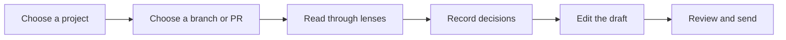
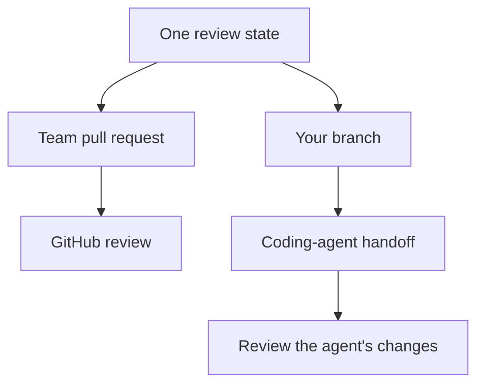

Rennet turns a local branch or GitHub pull request into an ordered review. Both
sources use the same reading and decision tools, then produce an artifact suited
to their destination.

## The review loop

1. **Choose a project.** Add one repository or a workspace containing several
   repositories and worktrees.
2. **Choose a change.** The project list combines local branches and GitHub pull
   requests. **Local**, **PRs**, **Mine**, and **Needs you** filter that list.
3. **Read the change.** Use Sequence, Spec, Decisions, Flagged, and Noise without
   changing the patchset under review.
4. **Record decisions.** Comment, ask a question, request a change, discuss, or
   approve at the relevant cohort, requirement, chunk, range, or line.
5. **Edit the draft.** Reword, reorder, merge, split, stage, or withdraw the
   collected items.
6. **Review the outbound artifact.** Rennet composes the GitHub review, pull
   request, or coding-agent handoff from that draft.

The change list paints local branches first, without waiting for GitHub. Pull
requests join the same list as each repository finishes loading. While that work
is in flight, the status names the repository and reports the completed count
instead of estimating a percentage. If GitHub authentication or networking
fails, local work stays available and the project view offers reconnection where
it is needed.

## Team pull requests and your own branch

For a team pull request, Rennet posts one review pinned to the reviewed commit.
For your own branch, Rennet can send the selected requests to a coding agent,
capture the resulting changes, and focus the next review on that successor
patchset. It can then push the named branch and open the pull request described
by the draft.

Across patchsets, a disposition carries only when content is byte-identical at
the same path and the match is unambiguous. Changed or ambiguous work reopens for
review.

## Use the command palette

Press `Command+K` on macOS or `Ctrl+K` elsewhere to open the command palette. It
shows commands relevant to the current view, including navigation, recent
locations, lens changes, zoom, review regeneration, appearance, settings, and
outbound draft actions.

`Command+[` and `Command+]` move backward and forward through navigation history.
On a loaded canvas, `l` zooms in and `h` zooms out. A command that cannot run in
the current state is omitted.

### Remap shortcuts

Open **Settings > Keyboard** to change a stable command's shortcut. **Set** records
the next supported chord, **Unbind** removes the shortcut, and **Reset** restores
the default. Changes take effect immediately and are stored in
`~/.rennet/config.json`.

The recorder accepts a bare key or the platform's primary modifier plus one key.
It does not record Shift or Alt combinations. When two commands share a chord,
both rows report the collision and the first registry match runs. If the config
contains an invalid chord, Rennet shows the raw value and uses the default until
you replace, unbind, or reset it.

## Open app destinations

Click the Rennet mark in the top-left corner to open **Settings**, return to
**Projects**, or open the documentation. The current version appears in the same
panel. When an update is ready, the mark shows a badge and the panel adds a
restart action.

Settings also opens with `Command+,` on macOS or `Ctrl+,` elsewhere.

On macOS, the native application menu provides system editing and window
commands. Rennet commands remain in the command palette. Windows and Linux do
not show a separate application menu strip.

## Reopen a review

Captured reviews are persisted locally. Reopening one restores its patchset,
read state, dispositions, delta account, and conversation threads without
running the review again.

If the original worktree is gone, the captured review remains readable. Commands
that need the repository report that the worktree is unavailable.

Rennet also persists navigation history for project and review views. When a
stored location no longer loads, it is removed from the route and Rennet returns
to the nearest available view. **Projects** remains the fallback.

## Configure Rennet

Settings has four sections:

- **Global** contains appearance and GitHub account settings.
- **Repo** contains project-specific settings such as map visibility and
  [where commands run](./windows-and-wsl.md#choose-where-commands-run).
- **Keyboard** contains shortcut overrides.
- **Pairing** creates pairing codes and lists paired devices.

A setting reports whether its value came from a built-in default, environment
detection, global config, or repository config. **Pin** stores the resolved value
for the repository. **Reset** removes that repository override and returns to the
inherited value.

If a repository config file cannot be parsed, Rennet shows built-in defaults and
disables writes for that file.

## Local-first and remote use

Rennet has no hosted backend and no Rennet telemetry service. Its daemon and
review state run on a machine you control. A selected coding harness may send
assembled context to its provider, and Rennet records the context it assembled.

A paired device connects to the daemon over your private network. See
[Remote access](./remote-access.md) for binding, pairing, and path projection.

## Desktop updates

On Windows, Rennet checks the project's public GitHub Releases for updates every
five minutes. Once an update is staged, the Rennet mark and tray icon show a
badge. Use **Restart Rennet to update** from either menu to apply it. Rennet does
not restart automatically.

Public signed macOS releases and macOS auto-update are tracked in
[GitHub issue #298](https://github.com/rbutera/Rennet/issues/298).

## Close or quit the desktop app

Closing the window leaves Rennet in the macOS menu bar or Windows system tray.
The local daemon and a running review continue in the background. **Open Rennet**
restores the window and reconnects it to that daemon.

The tray menu contains:

- **Open Rennet** to focus or recreate the window.
- **Restart Rennet to update** when an update is staged.
- the installed version.
- **Quit** to exit the app.

When the desktop app owns the local daemon, the quit label states that the daemon
will also stop. A running turn is stored as interrupted and can be retried after
the next start. Quitting a client connected to a remote daemon does not stop that
remote process.

## Next steps

- [Review a GitHub pull request](./reviewing-a-github-pr.md) covers the team review path.
- [The Context Map](./context-map.md) covers stored project structure and knowledge.
- [Windows and WSL](./windows-and-wsl.md) covers host and distro execution.
- [Common questions](../concepts/common-questions.md) covers models, credentials, and data.
