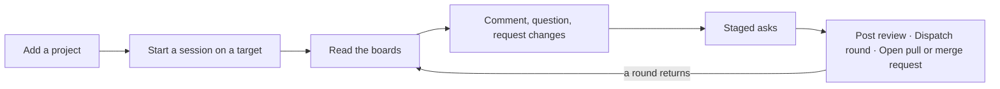
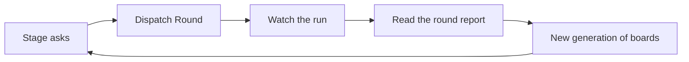

Rennet reads a branch or a pull request and drafts it into boards you can
actually read. What you raise while reading becomes one GitHub review, a work
order for a coding agent, or the pull request itself. This page walks that loop
once, end to end.

## First run

On a new client with no projects, Rennet opens a full-window welcome. It
introduces the review model, applies appearance choices immediately, shows the
tools detected in this environment, and lets you choose the orchestrator and
Dual Harness mode. Dual Harness starts on when both Claude Code and Codex are
available.

If neither harness is detected, install [Claude Code or Codex](./install-a-coding-harness.md)
and check again. The welcome does not replace the contextual
[onboarding tour](./onboarding-tour.md); coach marks begin after setup as you
reach the controls they explain.

The welcome ends by opening the same **Add Project** browser described below.
After the project is added, **Start a new chat** opens the real New Chat screen
for it.

### Replaying the welcome

The welcome is not a one-time event you can only see on a clean install. Open
**Settings → Appearance → First Run** and choose **Replay the first-run welcome**,
or run the same action from the command menu (`⌘K`). It reopens immediately, over
whatever you were doing, on a client that already has projects. There is no
confirmation, because nothing is destroyed: your projects, appearance, and
sessions are untouched, and finishing the welcome puts it away again.

A replayed welcome does not ask you to add a project again. Its **Project** step
offers **Continue with _your project_** — the one you used last, or the first in
your list — so **Ready** and **Start a new chat** are one click away, and the
picker is still there if you do want to add another. Replaying the welcome does
not re-arm the [onboarding tour](./onboarding-tour.md), and replaying the tour
does not reopen the welcome.

## The review loop

## Add a project

**Add Project** in the sidebar opens a dialog with two parts: a source picker
and a directory browser.

The source picker lists every environment Rennet can reach — this machine,
each WSL distro on Windows, and any environment you have paired — and ends with
an **Add Environment** escape into pairing. Switching source reloads the browser
against that machine's own filesystem, so browsing a distro or a paired machine
works exactly like browsing locally.

The browser is the picker. There is no OS file dialog and no recents list.
Click a row to descend, use **Up** or Backspace to ascend, or type an absolute
path and press Enter to jump there. Arrow keys move between rows. A folder
holding a repository wears a **repo** badge; a folder Rennet cannot read is
dimmed and cannot be entered. **Add** stays inert until you select a folder.

On macOS, the welcome also offers **Grant Full Disk Access** beside Add Project.
It opens **System Settings → Privacy & Security → Full Disk Access**. This is
optional and is useful when the in-app browser needs to reach protected or
external locations. Rennet reads only projects you add; the setting does not
make Rennet scan unrelated files.

Pair a new environment with **Add Environment**: it takes an address and a
one-time code. Run `rennet pair` on the other machine and it prints a link that
fills both fields.

### What happens after you add it

Adding a project lands on its processing view. A scout reads the git remotes,
checks for issue-tracker markers and CI config, reads the README, contributing
guide, and any agent instruction files, then reports how many answers it
detected and how many it guessed. The structural map is built when the scout
returns. The header status reads *scouting*, then *indexing*, then *indexed*.

While the map builds, a prefilled questionnaire offers the project's setup for
a look: issue tracker, default branch, worktree location, gate command, and the
project's mark. Every answer carries a chip reading **detected** or **guessed** —
the value, provenance, and evidence line come from the scout record Rennet just
saved, rather than from canned UI defaults. A detected logo path remains cosmetic:
it is evidence for choosing one of the fixed sidebar glyphs in **Settings →
Projects → Identity**, and never enters agent context. Answer it or skip it — the
map finishes and the project works either way.

When the map is built, the processing view shows a **Project Ready** summary —
its scope and file counts — and a full-width **Start a Review** button beneath it
that carries you into New Chat for the project you just added. That ready state
appears only once the run's last phase has settled; the same boundary clears the
project's sidebar spinner, so an indexed header never sits above a running
timeline. **Start a Review** is still offered after a failure, because a rough
index never blocks you.

Nothing here calls a model to summarize your repository. The map is read off the
tree: files, packages, entry points, exported symbols, and imports. When a review
runs, each lens is a coding agent started in the reviewed checkout — it reads the
code itself, with the tools it would have anyway.

The processing command has a stable identity and stores scout and structural-map
checkpoints beside the map. Reopening the view reattaches to that run. If the
daemon restarts, it resumes the first incomplete phase and reuses completed work
instead of duplicating progress rows.

The project remembers which machine it lives on and reconnects there when you
reopen it. See [Windows and WSL](./windows-and-wsl.md#wsl-requirements) for
distro requirements.

On macOS, the first run also detects which coding agents and forge CLIs you have
installed, by asking each one for its version. If one of those binaries is an old
build, macOS may show an XProtect warning about *that* program. Rennet bundles no
harness binary and reads nothing but the version each one prints — the warning is
about your own installed CLI, and updating it clears the notice.

## Start a session

A **session** is one conversation — its own thread in the chat panel — and
everything hanging off it. It claims exactly one **review target**: your branch, your PR, or a
teammate PR.

**New Chat** in the sidebar (`⌘N`) opens a searchable project picker. Choosing a
project shows that project's branches and pull requests in one list. Local
branch rows appear immediately; pull-request rows join as each repository
finishes loading, and the progress names the repository being read rather than
guessing a percentage. If GitHub is unreachable, local work stays available.
The back arrow or Escape leaves New Chat for the surface you came from. When the
filter contains text, the first Escape clears it and the next leaves.

Clicking a row starts the session — it is not a selection you then confirm.
Rennet mints the session, claims that target, and takes you into it immediately.

The workspace opens at once, on **the bench**: its first frame, inside the same
shell as everything else, with the sidebar, the session top bar and the chat
slot already around it. The change itself is the centrepiece — the branch or
pull request you started from, and once capture settles, how many files were
captured. Capture is the bench's first beat rather than a page in front of it:
two named steps, *resolving the repository* then *capturing the change*, with
cancel beside them.

Five readers stand under it, one per lens. Each has its own mark, a lantern that
is lit only while that seat is actually working, and a line of what it is doing
right now, read straight off that seat's own thread — the file it is reading,
the command it is running, or the last thing it said. A seat that has gone quiet
says so instead of freezing on its last line. A settled reader turns green and
shows what its board came back with; a failed reader turns red and speaks the
reason it failed, rather than spinning forever.

Every reader is also a control: activating one opens that seat's full transcript
in the chat slot, read-only, and it keeps streaming while the seat runs. A
reader whose seat has not opened a thread yet is inert rather than pretending to
have one.

You can leave the bench without stopping the work, or cancel and retry it in
place. A failed capture or board generation keeps the session and names the
failed stage instead of dropping the review. Anything already typed in the
composer travels with you as the opening ask, waiting in the chat box rather
than being sent for you. When preparation settles, the bench gives way to the
populated review workspace.

What gets captured depends on the row. A pull-request row opens that pull
request's diff. The pinned **Current Checkout** row captures your working tree,
uncommitted edits included. A local branch row captures that branch's own
commits — everything since it left the project's primary branch — **without
checking it out**. Nothing on disk moves, and you can review a branch you are not
standing on.

That difference matters once you are reading. A working-tree capture is watched:
edit the repository and the review says it went stale, and offers to regenerate.
Only *your* edits count. Rennet keeps each board's own storage under
`.rennet/boards/` in the repository, and that storage is excluded from what a
review captures and from what the watcher compares, so a board Rennet writes
never makes the review it belongs to look out of date — including after quitting
and reopening. Anything else you keep under `.rennet/` is your project's content
and is reviewed like any other file.
A branch or pull-request review is a snapshot of fixed commits, so it is not
watched and never claims to have gone stale — there is nothing for it to drift
against.

A branch with no commits of its own — already merged, or identical to its base —
opens as an empty review. That is the honest answer rather than a click that
appears to do nothing.

A claimed target leaves the list, so two sessions can never fight over one
branch; clicking the same target again returns you to the session that owns it
rather than starting a second. The pinned **Current Checkout** row is the
exception: it starts a session about the project as a whole, claims nothing, and
so never leaves the list. Sessions nest under their
project in the sidebar, each leading with the target icon its claim proves — a
branch glyph, or a pull-request glyph once the session claims a PR. Whether a
teammate authored that PR, and whether its review is waiting on you, are not
facts the session record carries, so a row states neither rather than guessing;
those states arrive with the source that can answer them.

The source list does carry those states. A row reads **Needs you** when a review
request or failing CI needs attention, **Reviewed** once its local review stage
has completed, and **Merged** after its pull request closes. The state label
wins over the more general owner label.

Once boards exist the target is locked. Reviewing something else means a new
session.

Right-click a session for **Pin**, **Rename**, or **Archive**. Pinned sessions
rise to a Pinned section at the top of the tree; archived ones move to
**Archived** at the sidebar's foot. Sessions are records: reopening one restores
its transcript, its boards, and everything you staged, including generations
frozen by earlier rounds.

Right-click a project for **Rename**. The name edits in place: Enter saves,
Escape cancels, and an empty value restores its `org/repo` name. Renaming does
not move the current route because navigation keeps the project's stable
identity rather than its display name.

## Read the boards

Each lens is its own board. The session top bar centres the lens rail and keeps
the boards in the order shown below. The session URL owns the selection:
Flagged is the address-free default and another lens uses `?lens=`. A completed
frozen generation without Flagged falls back to its first available board and
replaces the URL with that honest address. A live generation keeps the requested
address while its boards arrive. Selecting a lens from History or Diff
returns to its board. Reloading the URL opens the same selection.

| Board | Question |
|---|---|
| Design | What should the change do, and which requirements have evidence? |
| Sequence | In what order should I read the implementation? |
| Decisions | Which implementation choices need explanation? |
| Flagged | Where did automated analysis find a problem or a disagreement? |
| Noise | What remains, and why may it need less attention? |

A lens rail shows only the boards present in the selected generation. Reviewing
a proposal before any code exists gives you Design alone, not four disabled
segments.

The board drafter writes each title and short intro. Design uses a wider
structured measure for artifacts. Sequence, Decisions, Flagged, and Noise use a
narrower reading measure. Sections fold to a one-line gist and unfold to their
contents; every board opens folded except Flagged, which opens ready to read.
Folded counts name review objects: findings, decisions, requirements, steps,
outcomes, groups, files, and comments.

Code is cited, never copied. A code block card carries the file path and the
exact line range and hydrates the real lines from the captured patchset, so
numbering cannot drift from the code under review. When that path belongs to the
active captured patchset, clicking it opens Diff on the file and preserves the
other session query state. A code card adds **View test** or **View
implementation** when both files are changed paths in that active patchset. An
unchanged or uncaptured counterpart gets no jump. In prose, a `path:line`
citation is a chip: click it and the real lines unfold below the paragraph;
click again and they fold away.

A finding reads as flowing document text, not a boxed card: a severity chip, the
claim as its title, a concurrence badge, then the body and the proposed fix as
its own callout. The badge reads "concur 2/2" only when both review seats raised
the finding at comparable severity; "severity split" when both raised it but
disagreed on how much it matters; the seat's name and "only" when one raised it
and the other did not; and the seat's name alone, quietly, when a single harness
ran and there was no second opinion to compare. **Request This Change** stages that fix for
the hand-off; the same control becomes a **Staged · Request Change** receipt and
unstages it when clicked again.

### Diff

Beside the switcher sits the **Diff** pill. It opens the
raw patchset in the familiar files-changed shape: a filterable file tree on the
right, per-file cards with unified hunks and dual line-number gutters on the
left, a summary line reading files changed with total additions and deletions,
and a per-file **Viewed** checkbox that collapses the card and ticks the tally.
Diff is not a board — it is the raw source, always one click away. Large
patchsets keep the summary and complete file tree responsive while Rennet
windows the file cards and diff rows; choosing any file still lands on its
exact virtual position.

## Raise what you find

Three routes, one result.

**Highlight board prose.** A toolbar appears above the selection with
**Comment**, **Request Changes**, and **Explain**. Comment opens a small editor
quoting the span; `⌘`/`Ctrl` + Enter saves. The quoted text keeps a durable
highlight afterwards — click it to reopen the thread, read the replies, and add
a follow-up. Explain asks the session's chat thread a question; it is not review
content and never counts toward an exit.

**Comment on a line.** Hovering a line of code turns its line number into a
`+`. Click it for an editor offering **Save**, **Request Changes**, and
**Delete**. The same editor serves board code, the Diff view, and code in the
chat — a comment made on one surface is the same object everywhere. Diff line
comments key to new-side line numbers, so a requested change carries a real
diff position.

**Say it in chat.** The chat column beside the surface is the review's T3 Code
thread, and it travels with you across every board. Ask it about the change and it
runs a real turn on your own installed harness, working in this review's checkout,
and streams the answer back as it arrives. The thread persists in the sidecar, so it
is still there after a reload. Asking about a highlighted span sends your question
with the cited lines into the same thread and opens the chat on the answer.
Nothing the thread says stages anything: you stage an ask yourself, from the board,
a line, or a highlighted span.

## Stage asks

An **ask** is the staged unit of the hand-off: text, an intent (comment or
request change), provenance back to the finding, comment, or thread it came
from, and a code anchor where one applies.

Findings never stage themselves. Staging records your judgement, not the
board's output, so every staging control is also its own receipt and its own
undo — press **Request This Change** and it becomes "Staged · Request Change ✓";
press it again to unstage.

The gold button at the bottom right of the surface is the basket. It reads
**Write Review** on a teammate PR and **Continue** on your own branch or PR, and
carries one red count: staged asks plus the comments and threads not yet claimed
by one. Explain threads never count. Undo of any kind takes the count back down.

## The three exits

The gold button opens the hand-off view — a view over the main surface, exactly
like Diff, and the back arrow leaves it. What it offers depends on the
target.

### Post one GitHub review

On a teammate PR there is one lane: **Post Review**.

The verdict is a three-way control — Approve, Request Changes, Comment —
proposed from what you actually did, with the arithmetic stated beside it
("proposed from your review · N request changes · M comments"). It is always
flippable, and an overridden verdict says so and offers "use proposal" to go
back. With no asks, Approve is the proposal. Its draft opener is grounded in the
active review evidence and your durable acts, not an empty shell.

The draft renders exactly as it will post, so there is no separate preview
stage: the exact review body and line-comment threads. Ask provenance and any
flattening ledger remain visible beside that post descriptor. The signing view is
read-only. Steer the underlying asks with **Revise**, **Drop**, and **Explain** before
opening it; if the preview is wrong, return to the review, revise the durable ask,
and reopen the signing view to compose new bytes.

A residue line states the bare count of threads and code comments that stay
local. One **Post Review** action sends it, under your name, as one review
pinned to the reviewed commit. The posted state names the PR, the verdict, the
line-comment count, and links to the review on GitHub.

If the pull or merge request advances before posting, Rennet sends nothing from
the stale preview. **Review latest revision** starts a new review of the same
provider target and opens its capture progress; the review you already read
stays pinned to its original head and bytes.

### Dispatch a work order

On your own branch the hand-off is one goal in two states, and the page's shape
tells you which one you are in.

While asks remain, the page is **Changes**: one card per ask with its intent,
provenance, text, and anchor. The same **Revise / Drop / Explain** steering
works on an ask's text. **Dispatch Round** sits beneath the cards. The pull
or merge request waits as a single muted line at the foot.

Dispatch becomes available when at least one staged comment or request-change
gives the coding worker something to address. Questions and approvals stay with
the review; Rennet does not turn them into code work. If the daemon finds no
coding work when asked to dispatch, the page stays here, says that no round
started, and keeps the staged notes.

Work orders exist on your own branch only. A teammate PR never offers one.

### Open the pull or merge request

When nothing is left to ask and the description is ready, the page *is* the
change request: the title as its heading, the drafted description rendered
beneath, and one provider-named action that pushes the branch and opens it.
GitHub shows **Open Pull Request** and a `#` receipt; GitLab.com shows **Open
Merge Request** and a `!` receipt, using the authenticated `glab` in that
repository's host or WSL environment.

After the pull or merge request exists, rounds continue exactly as before.
There is no separate lane for reviewing your own change request.

## Rounds

A **round** is one dispatched work order and the successor patchset it returns.
Rounds run one at a time; asks you raise mid-run queue for the next one.

An accepted dispatch moves you to the live run: the detached worktree being
created, the round's asks being applied, the worker's activity as a table of
steps, your project's gate command running and resolving, the commits, and the
round report being drafted and checked. Closing and reopening the run, or
following its direct link on another launch, resumes from the latest saved step
without dispatching the work again.

As soon as Rennet has saved and checked the report, it takes you back to the
review and shows that report. It does not wait for every board to finish. If you
close or reload the app there, the same report and current regeneration progress
come back. If the remaining work later fails, Rennet returns you to the run's
failure screen and keeps the incomplete boards hidden. The session row reads
*Round N is back* only after the round finishes, using its saved ledger number.

The **round report** is what greets you while the boards regenerate. It states what
the round did, where it ran, and how the gate came back, then lists one item per
ask: **Addressed**, **Partial**, **Untouched**, or **Beyond the Asks** for work
the round did that you never requested. Every outcome is verified against the
round's diff rather than taken from the worker's word, and each item names the
ask it traces to and reveals the code where one applies.

The report is measured before it is drafted, and a round whose diff is larger than
the report can honestly carry stops there rather than classifying part of it. The
failure names the measurement and the limit it passed, and no model is asked
anything — Rennet does not summarise a change down to a size that fits and then
describe the smaller change as if it were yours. Split the work across rounds.

You read the report while the boards regenerate live beneath it, one lane per
lens. Every lens drafts again each round; a lane reads **carrying forward** when
that lens came back with nothing changed, **reworked** when it moved, and
**failed** with the reason when it produced neither a board nor a trustworthy
empty result. In
between it reads **drafted** — the board is written, the comparison not yet run.
The lane and the board agree by construction — both read the same comparison —
so a lane never claims a lens carried while its sections changed, or while a
section it used to have went away. Each lane settles on its own — nothing waits for
the slowest lens — so the lanes finish in the order the work actually finished.

Beneath the lanes sits one **Cross-lens coverage** row. It runs once, after every
lane has settled, and reads *still running*, *every hunk covered*, *N hunks
uncovered*, or *could not be computed* with the reason. Uncovered hunks wear a
caution mark, never a green check: coverage is a note beside boards you can already
read, and it never rewrites one of them.

The surface never locks. **View the New
Boards** appears only after regeneration has finished and the whole new
generation is ready, never as a disabled button waiting to light up.

The new generation shows you the delta by its own shape. Sections the round
touched open expanded with a small gold dot; sections that carried forward stay
folded to their gists. The dot rolls up to that board's segment in the switcher
and clears for good once you open the section. The previous generation stays
readable as a folded drill-down, and Sequence grows a "Round N · Addressed"
chapter at its foot, newest last. The selected generation lives in
`?generation=` in the session URL, so reload, Back, and a direct link return to
the same frozen board. With no frozen predecessor, the generation control is
absent.

Once a round has completed, a **History** control joins Diff in the
header, making the pill read **History · Diff**. It lists one row per round with its tally; selecting a round renders its
full report. Each modern row states when the round ran, its exact branch or
detached target, the coding harness and version that ran it, and the outcome tally
from that round's own report, so nothing
you have already read ever vanishes or gets relabelled by a later round.

To inspect a slow or failed round on macOS, choose **View → Toggle Developer
Tools**. Electron opens its standard developer console. Entries tagged
`[rennet:round]` show the review, operation revision, durable phase, report
handoff, and each lens status with real timestamps. A classified report adds
fixed milestones for turn start, provider settlement, turn settlement, schema
parse, evidence verification, and persistence. Those milestones contain only
fixed status values and elapsed milliseconds, never code, prompts, model output,
diffs, paths, evidence, notes, or provider prose. A terminal operation failure
still includes the daemon's exact local reason, matching the failed round shown
in Rennet. Leave the console closed during ordinary use.

## Move around quickly

Press `⌘P` (or `⌘K`) to open the command menu from anywhere — the same menu the
sidebar's **Search** row opens. It filters fuzzily over your sessions, each
project's new-chat entry, every settings page, and the
add-project and add-environment actions. Board and diff content is deliberately
not searchable from here; the boards are where you read.

Command mode leads with app actions such as **Add Project** and **Add Environment**.
Raw protocol commands appear only when they need no context and produce a visible
result; none qualify today. GitHub fallback cleanup stays in **Settings →
Environments → GitHub account**, which can prove the credential source before
offering **Disconnect**.

| Shortcut | Action |
|---|---|
| `⌘P` | Search |
| `⌘K` | Command menu |
| `⌘N` | New chat |
| `⌘B` | Toggle the sidebar |
| `⌘J` | Toggle the chat column |
| `⌘,` | Settings |

Use `Ctrl` in place of `⌘` on Windows and Linux. **Settings → Keyboard
Shortcuts** lists every command with its binding, filterable by name, with a
**Change** control on each row.

## Settings

Settings takes over the view and leaves by the back arrow or Escape. It has four
pages:

- **Environments** — one card per machine, with its OS glyph, name, and address
  or a **Local** chip. Each card carries the source-control tooling detected
  there, the coding harnesses detected there, and the model mappings for the
  review roles — each detected on that machine, so a card never borrows another's
  tooling. Rename inline; Reconnect appears only when a machine is unreachable,
  and re-attempts the connection for real — it says "Connecting…" while it tries,
  then either the card comes back or it tells you why it did not. Update Daemon
  appears only when a machine really has a newer daemon to move to, and behaves
  the same way: it updates for real, then shows the new version or the reason.
- **Appearance** — light / dark / system, the interface theme pack, and a
  separate code theme that applies to every code surface including the diff.
- **Keyboard Shortcuts** — every named command and its binding.
- **Benchmarks** — a switch for benchmark recording (on by default) and the local
  history of recorded runs, each broken down by stage and grouped by the harness
  mode its stages actually name. The list is paged and states how many runs it is
  showing out of how many were recorded. Nothing here leaves your machine.
- **Projects** — scoped to one project: its name and mark, worktree location
  and naming pattern, review context, issue tracker, and the guidance rules the
  review agents read. The name is live — renaming here renames the sidebar row,
  and emptying it restores the project's `org/repo` identity. The mark, worktree,
  issue-tracker and guidance editors have no store behind them yet; they render
  disabled and say so, rather than accepting edits that would vanish.

Every layered value shows a chip naming where it resolved from — builtin,
detected, global, or repo — and every section states the file behind it.

## Local-first and remote use

Rennet has no backend of its own and no Rennet telemetry service. The daemon and
your review state run on machines you control.

Material selected for a review turn goes to the coding harness you chose and to
that harness's model provider, and Rennet records the exact context it
assembled. GitHub receives an outbound review only when you post it.

A paired machine connects over your private network. See
[Remote access](./remote-access.md) for binding, pairing, and path projection.

## Updates and the desktop app

When a release is ready, an **Update** control appears at the sidebar's foot. It
opens a dialog listing what the release contains, with **Later** and **Update
Now**. Rennet never restarts itself without you.

Choosing **Update Now** or **Restart Rennet to update** first stops the local
daemon that runs from the installed app bundle, then lets the platform updater
replace that bundle and relaunch Rennet. The new app starts its matching daemon
and reconnects to the durable review state. On macOS, Rennet also arms a small
out-of-bundle relaunch helper before ShipIt replaces the app, so a successful
install still reopens when the native updater omits its own relaunch. If the owned daemon cannot stop,
Rennet stays open and reports the failure instead of closing without installing.
If macOS or Windows rejects the native install handoff after closing the window,
Rennet restarts its daemon, restores the window, and shows the updater error so
you can retry from the same review state.

Closing the window leaves Rennet in the macOS menu bar or the Windows system
tray, with the local daemon and any running review intact. **Open Rennet**
restores the window and reconnects it. When the desktop app owns the local
daemon, quitting says so, and an interrupted turn can be retried after the next
start. Quitting a client connected to a remote daemon does not stop that remote
process.

Public macOS releases are signed with Developer ID and notarized by Apple. The
packaged app checks the public GitHub-backed update feed every five minutes
until an update is downloaded, then stops checking so the staged install stays
installable until you choose it; development and ad hoc packages do not contact
the feed at all.

## Next steps

- [Review a GitHub pull request](./reviewing-a-github-pr.md) covers the teammate review path in full.
- [Windows and WSL](./windows-and-wsl.md) covers running against a distro.
- [Common questions](../concepts/common-questions.md) covers models, credentials, and data.
