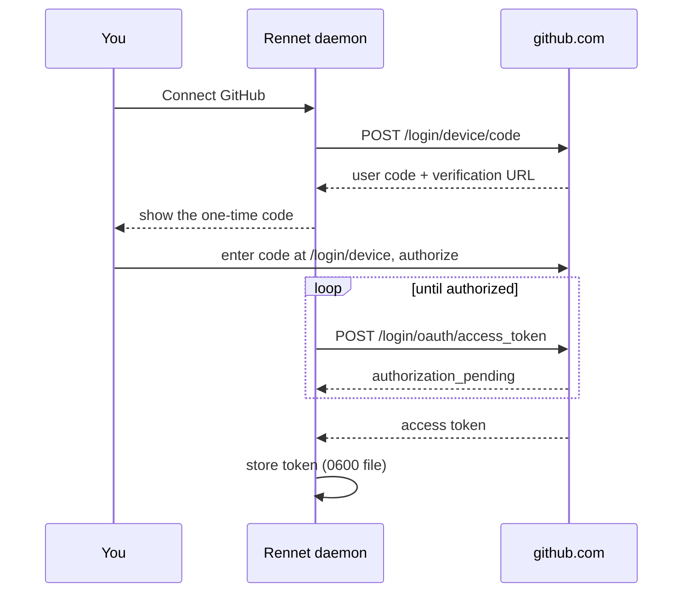

Rennet talks to GitHub directly from your machine. It signs in through GitHub's
OAuth device flow, stores one credential in a private file on disk, and uses it to
read pull requests and post your review. There is no Rennet backend in the path.

You only need this to review GitHub pull requests or post a review. Reviewing
your own local working tree needs no GitHub account.

## Sign in with a device code

When a command needs GitHub and no account is connected, Rennet offers the
sign-in. You can also start it from Settings.

1. Choose Connect GitHub. Rennet asks GitHub for a device code and shows you a
   short one-time user code.
2. Open `github.com/login/device`, enter the code, and authorize the Rennet
   OAuth app for your account. An organization owner may need to approve it.
3. Rennet polls GitHub in the background until you authorize, then stores the
   token. The Connect card turns into your connected account.

The user code expires after about fifteen minutes. If it lapses, or you dismiss
the card, start again. Rennet keeps only one sign-in in flight at a time.

The Rennet OAuth app uses a public client id and no client secret. Every request
in this exchange goes from your machine to `github.com`. Rennet operates no
server that sees your code, your token, or the sign-in.

## What the token can do

The sign-in requests two scopes:

- `repo` reads and writes the repositories your account can already reach, so
  Rennet can read a pull request and post your review. Classic OAuth `repo`
  access is account-wide, not a per-repository pick.
- `workflow` is requested alongside `repo` so a token-authenticated request that
  touches files under `.github/workflows/` is not rejected. Your coding agent's
  branch push uses git's own credentials, not this token.

GitHub shows these scopes on the authorization screen. The token acts as you, so
it can do only what your GitHub account can already do.

## Where the token lives

Rennet stores one credential as a single file named `github-token` in the
daemon's data directory, with owner-only (`0600`) permissions. Anyone who can read that file can act as
you on GitHub until you disconnect.

| Platform | Location |
| --- | --- |
| macOS | `~/Library/Application Support/Rennet/github-token` |
| Windows | `%APPDATA%\Rennet\github-token` |
| Linux | `~/.config/Rennet/github-token` |

On Windows with a WSL project, the daemon runs inside the distro and keeps the
token there. See [Windows and WSL](./windows-and-wsl.md).

The token stays on the host. It never enters your project files, never gets
staged or committed, and is never sent to the desktop, browser, or mobile client
that shows your review. Rennet stores no other GitHub secret and adds no
inference markup.

## Refresh and expiry

If the OAuth app is configured for expiring user tokens, GitHub mints an eight
hour access token plus a longer-lived refresh token. Rennet refreshes the pair
for you, shortly before the access token expires or right after GitHub rejects a
call as expired, and saves the rotated pair. GitHub rotates on use, so the old
tokens die the moment the refresh succeeds. Refresh needs only the public client
id, no secret.

If the app issues non-expiring tokens, the credential carries no refresh half and
Rennet never refreshes it.

When GitHub declines a refresh because the refresh token expired, already
rotated, or was revoked, Rennet reports that you need to sign in again. Re-running
the device flow is the fix.

## Use a personal access token instead

Settings also accepts a personal access token as a side door. Paste one and
Rennet validates it against GitHub before storing it, so a bad paste saves
nothing. A personal access token has no refresh half; Rennet uses it as-is until
you replace or disconnect it. Give it the `repo` and `workflow` scopes to match
the device flow.

## Disconnect

Disconnecting deletes the token file. Rennet keeps no copy. Reviewing your local
working tree keeps working; anything that needs GitHub prompts you to sign in
again.

## When something is wrong

Rennet separates the failure states so you know what to fix:

- Not connected: no account yet. Sign in.
- Token invalid: the stored token was revoked or rejected. Sign in again.
- Insufficient scope: the token lacks `repo` access. Reconnect and approve it.
- Network: Rennet could not reach `github.com`. This is never reported as a bad
  token, because an unreachable GitHub says nothing about the token. Check your
  connection and retry.
