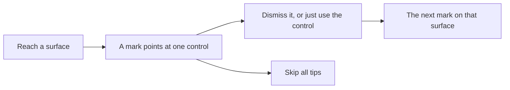

After the separate [first-run welcome](./getting-started.md#first-run), small
coach marks point out parts of the app as you reach them. The welcome configures
the client; the onboarding tour teaches controls in context. Completing,
skipping, or replaying either one never changes the other.

## One mark at a time, where it belongs

A coach mark is a short card pinned to the control it explains: a title and one
line. Rennet shows **one at a time, ever** — never a numbered "step 3 of 8"
overlay. A mark appears only when the thing it describes is on screen, so you
learn the board lenses on the board and the exit button when you first stage an
ask. Marks on the same surface chain: dismiss one and the next on that screen
follows a moment later.

The tour is the one place in Rennet that explains itself. Everywhere else the
chrome only names things; the coach marks are where the product is allowed to
teach. So the copy is deliberately small — a title, a sentence — and it never
asks you to confirm anything.

## Dismissing and skipping

A mark clears three ways, none of them a dialog:

- **Use the control it points at.** Clicking the thing counts as learning it —
  the mark retires itself.
- **Close it** with the ✕ on the card.
- **Skip all tips**, the link on every card, retires the whole tour at once.

Whatever you dismiss stays dismissed. A retired mark does not come back on the
next launch, and Skip all tips means no mark fires again until you ask for it.

## Replaying the tour

Open the sidebar and choose **Replay Tour** under Help. It re-arms every mark —
clears what you have seen and lifts Skip all tips — so the marks appear again as
you move through the app, starting with the first one on whatever surface you are
on.

## Where the tour's memory lives

What you have seen and whether you skipped are saved to
`~/.rennet/client-settings.json`, alongside your other app preferences. They are
personal to this machine, survive a restart, and never travel into a repository
or a review. See the [`coachmarks` field](../../developing/guides/settings-and-setup.md#global-settings)
for the stored shape.
