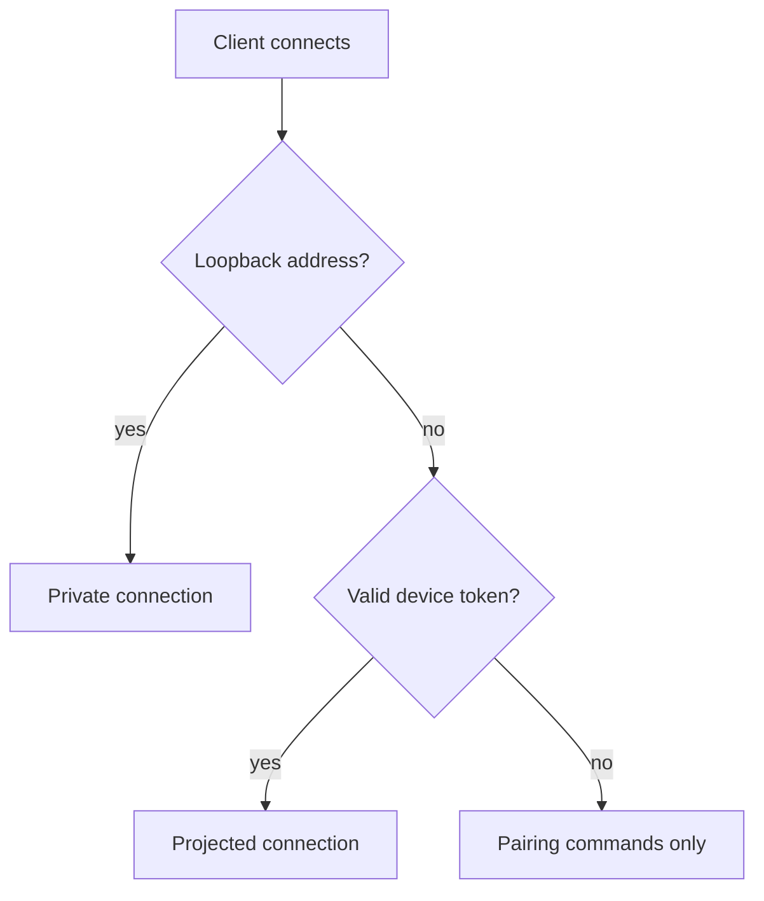

Rennet runs on the machine that holds the repositories. A paired phone, laptop,
or browser can connect to that daemon over a private network. Rennet does not
operate a hosted relay or backend for these connections.

## Connection classes

The daemon classifies a connection during its initial hello:



A private connection comes from loopback. It needs no token and receives local
paths.

A projected connection comes from another network address and presents a valid
device token. It can run review commands, but structural host paths are replaced
with repository references.

An unpaired network connection can exchange a valid pairing code. Other commands
are rejected.

## Bind the daemon

The daemon listens on `127.0.0.1` by default. Set `daemon.listen` in
`~/.rennet/daemon-settings.json` to accept connections on a private-network address:

```json
{
  "version": 1,
  "daemon": {
    "listen": { "host": "100.101.102.103" }
  }
}
```

An optional `port` fixes the listen port. After restarting the daemon, run:

```sh
rennet status
```

The status output and `~/.rennet/daemon.json` show the bound host and port.

When bound beyond loopback, the HTTP server checks the request's `Host` header
before upgrading a connection. It accepts the configured host, its address
literals, and localhost names.

## Connect with Tailscale

[Tailscale](https://tailscale.com/) provides the documented private-network
route. It attempts a direct WireGuard connection between devices and can use a
Tailscale DERP relay when a direct route is unavailable. In either case, traffic
remains encrypted between the devices and does not pass through Rennet
infrastructure.

1. Install Tailscale on the daemon machine and the remote device, then join both
   to the same tailnet.
2. Run `tailscale ip -4` on the daemon machine.
3. Put that address in `daemon.listen.host` and restart the daemon.
4. Use the host and port reported by `rennet status` from the remote client.

A browser opens `http://100.x.y.z:<port>`. A native client uses the daemon URL
inside its pairing link. This setup does not require public port forwarding.

## Pair a device

Pairing exchanges a five-minute, single-use code for a device token.

### Use the desktop app

Open **Settings > Pairing** and select **Create pairing code**. The same panel
lists paired devices and provides a revoke action for each one.

### Use the terminal

```sh
rennet pair
```

The command prints a fresh code and its expiry. The remote client sends that code
and a device name to the daemon. A successful exchange returns the raw device
token directly to that client.

The daemon stores only the token's SHA-256 hash in
`~/.rennet/devices.json`. A token expires after 30 days without use. Each
successful handshake renews that period. If a client loses or expires its token,
pair it again.

## Remote path projection

Projected connections use repository references in place of host paths:

- Repository roots and discovered project paths are replaced with a stable
  repository key and display name.
- Progress text produced by Rennet replaces known repository roots and the host
  home directory with display tokens.
- Remote commands send repository references back to the daemon. An unknown
  reference returns a typed error.

Loopback connections continue to receive local paths.

:::caution[Model-authored paths]
Structural protocol fields do not expose host paths to a projected client.
Model-authored prose is not rewritten. If a model quotes an absolute path in a
conversation or review message, that text can reach the remote client.
:::

## Revoke a device

Revocation removes the stored token, deletes its push registration, and closes
current sockets authenticated as that device. Future handshakes with the token
are rejected.

```sh
rennet devices
rennet devices --revoke <id>
```

The **Settings > Pairing** panel performs the same operation. A revoked device
can pair again with a new code.

## Next steps

- [Rennet in a browser](./browser-rennet.md) covers the browser shell.
- [Getting started](./getting-started.md) covers the review loop.
- [Common questions](../concepts/common-questions.md) covers models, credentials, and data.
