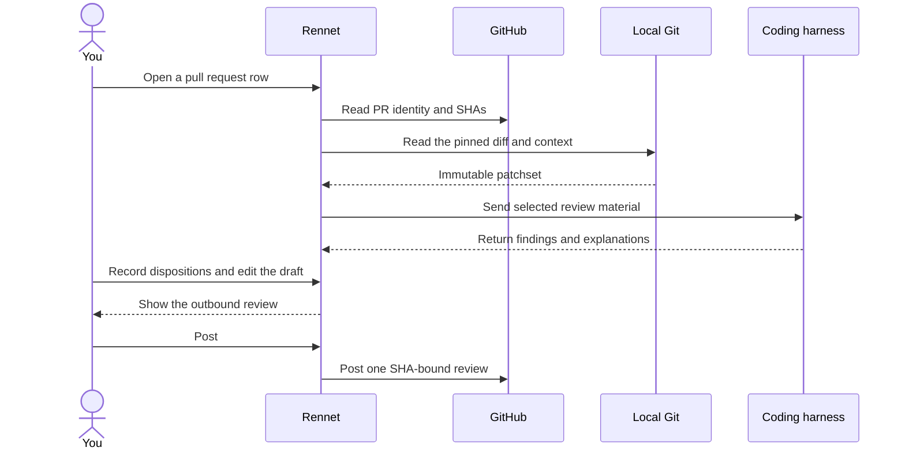
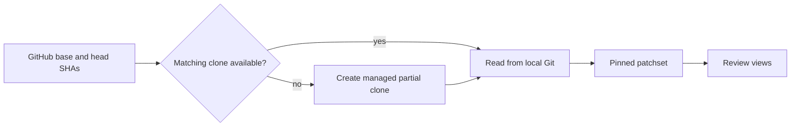
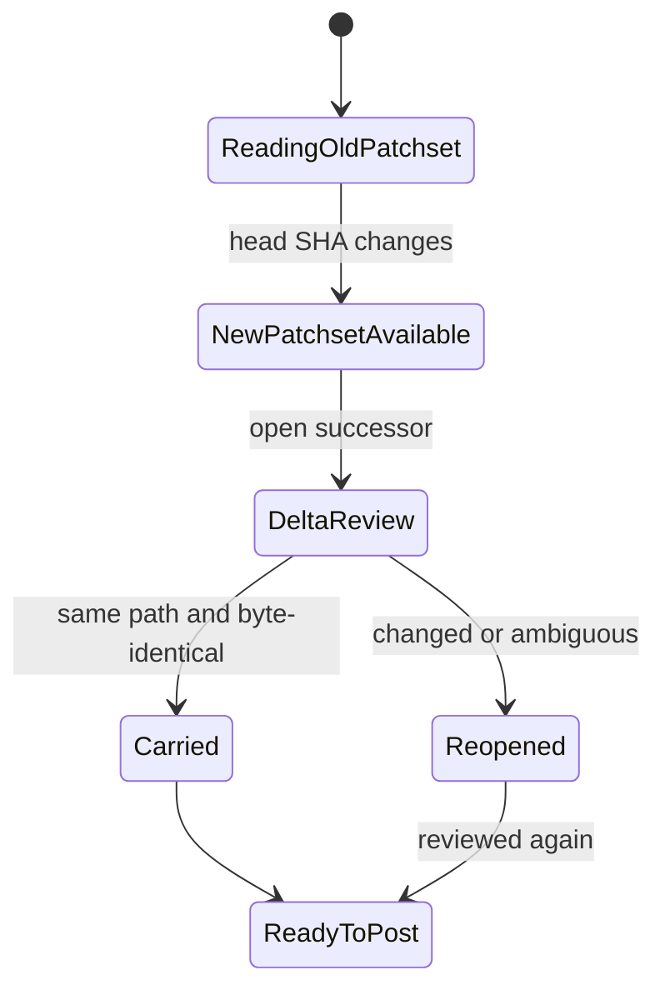

Rennet reads a pull request into an immutable patchset, keeps your decisions with
that patchset, and posts the selected comments as one GitHub review under your
account.

## Connect GitHub

Reviewing a pull request needs a connected GitHub account. Choose **Connect
GitHub** on first use or from Settings. Connection is optional for local
working-tree reviews; when a command needs GitHub and no account is connected,
the interface offers the sign-in at that point. See
[Connect GitHub](./github-auth.md) for the device flow, token storage, personal
access tokens, and reconnection after a failed credential.

Rennet also needs a supported coding harness. It discovers Claude Code without
asking for a model API key. When Codex is available, it can run as a second review
seat. An adjudication turn can inspect evidence behind a disagreement without
blocking the original finding.

## Review flow

1. Open a project and select a pull request. Use **PRs** or **Needs you** to
   narrow the project list.
2. Read the patchset through Design, Sequence, Decisions, Noise, and Flagged.
3. Approve, question, comment, or request a change at the relevant anchor.
4. Open the draft and edit the selected comments.
5. Review the composed outbound artifact, then post it as one GitHub review.

When a project spans several repositories, pull-request loading reports the
repository currently being read and the number completed. Local branch rows
remain usable throughout the fetch.

## Patchset source

GitHub supplies the pull request's base and head commit identities. Local Git
supplies the diff and nearby repository content. The resulting patchset remains
pinned to those commits.

If Rennet knows a matching local clone, it uses that clone. Otherwise it creates
a blobless partial clone under its application data directory. This retains Git
history and fetches file contents as needed. If an automatic clone cannot access
a private repository, Rennet asks for a local clone.

### Pull request worktree

Rennet creates a detached worktree at the reviewed commit. This gives review
conversations an executable copy of the pull request, including retrospective
reviews.

A repository can provide `.rennet/setup` with one shell command per line. Lines
starting with `#` are comments. Rennet runs those commands after checkout and
reports the worktree path and setup result. Setup failure does not prevent the
captured review from opening. When the pull request head changes, Rennet replaces
the worktree with one at the new commit.

## Merged and closed pull requests

The project list shows open pull requests by default. The **PRs** scope can show
merged, closed, or all states. Rennet pages this history from GitHub in
most-recent-first order.

Opening a merged or closed pull request creates a retrospective review. It uses
the same frozen diff but omits posting controls. Repository context is rebuilt at
the pull request's historical base. Direct pull request entry also offers a
retrospective option.

### CI checks

After automated review, Rennet reads GitHub checks for the reviewed commit and
shows their state in Flagged.

- A failure tied to changed code can become an anchored finding.
- A failure without a code anchor remains visible as a CI result.
- Only recognized environmental signatures receive the environmental label.
- Model classification can attribute a failure to the change or leave it
  unclassified.
- Missing, truncated, or timed-out CI is reported as unavailable and does not
  block review or posting.

## GitHub translation

Rennet converts the staged draft into GitHub's review shape:

- A line-anchored note becomes a review thread.
- A note without a line anchor is folded into the review body and recorded in
  the outbound ledger.
- Private conversations, withdrawn findings, reading progress, and model traces
  stay in Rennet.

The outbound view identifies what will be sent and pins the request to the
reviewed head commit.

## New pull request patchsets

A push, rebase, or force-push creates a successor patchset. It does not modify
the review already captured.

A disposition carries only across byte-identical content at the same path when
the match is unambiguous. Changed or ambiguous work reopens. See
[Delta re-review and lineage](../../developing/concepts/delta-rereview-and-lineage.md)
for the data model.

## Stored and outbound data

Review state, reading progress, conversations, and Rennet's review structure stay
in local application storage. Selected model context can go through the coding
harness and its provider. Rennet records the exact context it assembled for each
turn.

GitHub receives the outbound review only when it is posted. If GitHub is
unavailable, reviews already stored on disk remain readable.

## GitHub edge cases

For connection failures, Rennet retries once and then reports that GitHub is
unreachable. No review is recorded as posted without a successful result.

An organization can require SAML SSO authorization for the token. GitHub can then
return `X-GitHub-SSO: partial-results`. Rennet keeps that response distinct from
a complete or empty pull request list. The project screen currently shows a
generic incomplete-list message; authorize the token for the organization, then
refresh the project.

GitHub can also return a secondary rate limit. Rennet keeps the artifact as one
batched review and reports the backoff period. An idempotency marker and read-back
check prevent an uncertain retry from creating a duplicate review.

## Next steps

- [The Context Map](./context-map.md) covers stored repository structure and claims.
- [Product and vision](../concepts/product-and-vision.md) explains the shared review model.
- [Remote access](./remote-access.md) covers review from another device.
