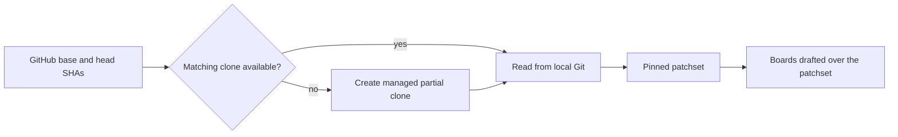

Reviewing someone else's pull request has one exit: a single GitHub review, in
your voice, under your account, pinned to the commit you read. Rennet pins the
patchset, drafts the boards over it, gathers what you raise, and drafts the
review — you post it.

## Before you start

Reviewing a pull request needs a connected GitHub account. See
[Connect GitHub](./github-auth.md) for connecting, storing, and repairing that
credential. Local branch reviews need no GitHub connection at all.

Rennet also needs a coding harness installed and authenticated on the machine
that serves the project. It discovers Claude Code without asking for a model API
key. When Codex is available too, the Flagged board runs both as independent
seats and records where they concurred. **Settings → Environments** lists what
was detected on each machine and which review roles run on which model.

## Open the pull request

Start a **New Chat** in the project and pick the pull request from the list. A
teammate PR whose review is requested of you carries its icon in the accent
colour and the words "needs you". The session claims that pull request as its
review target, and the claimed row leaves the list.

The session's gold button reads **Write Review** from the start — the target
decides the exit, and a teammate PR has exactly one.

## The pinned patchset

GitHub supplies the pull request's identity and its base and head commits. Local
Git supplies the diff and the surrounding repository content. The patchset stays
pinned to those commits for as long as you read it, so nothing shifts under the
review while you write it.

If Rennet knows a matching local clone, it reads from that clone. Otherwise it
creates a blobless partial clone under its own application data directory, which
keeps the history and fetches file contents as needed. If an automatic clone
cannot reach a private repository, Rennet asks you for a local clone.

### The pull request worktree

Rennet checks out a detached worktree at the reviewed commit, so review
conversations have an executable copy of the pull request.

A repository can carry `.rennet/setup` with one shell command per line; lines
starting with `#` are comments. Rennet runs those commands after checkout and
reports the worktree path and the setup result. A failed setup does not stop the
review from opening. When the pull request head moves, Rennet replaces the
worktree with one at the new commit.

## Read the boards

The boards are drafted over that pinned patchset: Design, Sequence, Decisions,
Flagged, Noise, with the raw files-changed view one click away behind the
**Map · Diff** pill. [Getting started](./getting-started.md#read-the-boards)
covers how a board reads — folded sections, cited code, findings and their
proposed fixes.

Nothing you do while reading changes the patchset under review. Switching boards
changes the angle, not the code.

## Raise comments

Everything you raise gathers as an **ask**, carrying provenance back to whatever
produced it:

- **A finding's fix** — **Request This Change** stages the fix with the
  finding's captured code citation, including its diff side and full span.
- **A line of code** — click the `+` in the gutter, write the comment, and
  choose **Request Changes**. On the Diff view these key to new-side line
  numbers, so the ask carries a real diff position.
- **A span of board prose** — highlight it and choose **Comment** or **Request
  Changes**; the quoted span becomes the ask's provenance.
- **A conclusion you reached in chat** — explicitly ask the orchestrator to stage
  it and Rennet records the completed action and receipt, or stage it yourself
  from the board, the line, or the span it belongs to. A suggested action is not
  silently staged.

Each finding keeps its controls together. **Request This Change** stages its
proposed fix. **Dismiss** removes it from the open set, and **Undo** restores the
dismissal. **Discuss** quotes the proposed fix — or the concern when the finding
has no separate fix — into the existing chat dock, opens and focuses that dock,
and sends one live question anchored to the finding.

Rennet stores those acts with the review and binds them to the finding's board
generation. They survive reload without attaching to a different generation
that happens to reuse the same finding id. When the same finding reattaches
unambiguously after a round, its dismissal carries into the successor while the
frozen board keeps its own history. The number on the **Flagged** lens is the
findings still open after staged requests and dismissals are applied.

The count on the **Write Review** button is your staged asks plus the comments
and threads not yet folded into one. Questions you asked with **Explain** never
count — they are yours, not the review's.

## Write the review

**Write Review** opens the hand-off view. On a teammate PR it holds one lane:
Post Review, headed with the pull request reference.

**The verdict** is a three-way control — Approve, Request Changes, Comment —
proposed from your own acts, with the arithmetic stated beside it. Any requested
change proposes Request Changes; other asks propose Comment; nothing proposes
Approve — approving is always your own act. Flip it whenever you like; an overridden verdict says so and
offers "use proposal" to revert. An approving review is a real review here: its
opener is grounded in what you walked and cleared.

**The draft mirrors GitHub's own shape**, because that is what posts. An ask
carrying a diff position becomes a line comment, grouped under its file with its
anchor. An ask without one — a quoted span of board prose has no diff line to
pin to — travels in the review body. Nothing explains the routing; placement
states it.

**Steer by highlighting.** Selecting draft prose offers **Revise**, **Drop**,
and **Explain**. Revise takes an instruction and re-streams that block. Drop
retires it to the **Retired** drawer, which keeps every retired block with its
reason and restores it with a click. Explain names the comment or finding the
sentence came from. Your revision survives a verdict change — the edit wins.

**Line-comment cards** expose Edit and Delete. Editing is inline;
`⌘`/`Ctrl` + Enter saves, Escape cancels. Deleting retires the card and unstages
its ask.

A residue line states the bare count of threads and code comments that stay
local. The draft you are reading is exactly what posts, so there is no separate
preview step. One **Post Review** action sends it as a single review under your
account, pinned to the reviewed head commit. The posted state names the pull
request, the verdict, and the line-comment count, and links to the review on
GitHub.

## When the author pushes again

A push, rebase, or force-push produces a successor patchset. It does not touch
the review you already captured, and a posted review stays pinned to the commit
it was written against. Reviewing the successor mints a new generation of boards
over the new patchset; the earlier generation stays readable.

## Merged and closed pull requests

The pull-request list shows open pull requests; it can also show merged, closed,
or every state, paged from GitHub newest first.

Opening a merged or closed pull request gives a **retrospective review**. It
reads the frozen change exactly as any other review does, and it offers no
exits — there is nothing left to post to.

## Data and outbound operations

Review state, boards, reading progress, and conversations stay in local
application storage on the machine serving the project. Material selected for a
review turn goes to your coding harness and its model provider, and Rennet
records the exact context it assembled. GitHub receives the review only when you
post it. If GitHub is unavailable, everything already stored stays readable.

## GitHub edge cases

- **Connection failure.** Rennet retries once, then reports GitHub as
  unreachable. No review is recorded as posted without a successful result.
- **SAML SSO.** An organization can require SSO authorization for the token,
  after which GitHub returns partial results. Rennet keeps that response
  distinct from a complete or empty list. Authorize the token for the
  organization, then refresh the project.
- **Secondary rate limits.** Rennet keeps the review as one batched submission
  and reports the backoff period. An idempotency marker and a read-back check
  stop an uncertain retry from posting a duplicate.

## Next steps

- [Getting started](./getting-started.md) covers the whole loop, including your own branch.
- [The Context Map](./context-map.md) covers stored repository structure and claims.
- [Product and vision](../concepts/product-and-vision.md) explains the shared review model.
- [Remote access](./remote-access.md) covers reviewing from another device.
