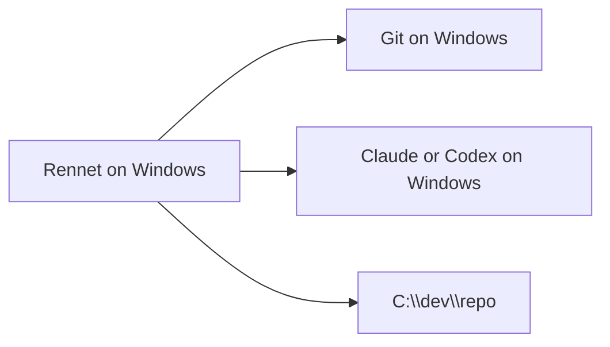

Rennet supports projects on Windows drives and projects stored inside WSL. It
records where each project's Git and coding-harness commands should run.

Public signed Windows installers and auto-update are tracked in
[GitHub issue #330](https://github.com/rbutera/Rennet/issues/330).

## Choose where commands run

A project uses either the Windows host or a named WSL distro.

- A path such as `C:\dev\repo` selects the host.
- A path such as `\\wsl.localhost\Ubuntu\home\you\repo` selects the `Ubuntu`
  distro and converts operations to its native `/home/you/repo` path.

Rennet detects this value from the project path. **Settings > Repo > Execution
locus** shows the resolved value and its source. You can choose the host, select
a different distro, or return to automatic detection.

**Pin** stores the detected value as a repository override. **Reset** removes the
override and returns to detection.

Rennet does not substitute a host command when the selected WSL distro is
unavailable. Harness status identifies the distro and reports whether WSL, the
distro, or a required binary is missing.

## Native Windows requirements



- Windows 10 or 11 on x64.
- Git installed on the host.
- Claude Code, and optionally Codex, installed on the host.
- A supported editor for line-targeted file opening.

Rennet finds `.cmd` and `.exe` shims on `PATH` and in common per-user locations,
including `%APPDATA%\npm`, `%LOCALAPPDATA%\Programs`, Scoop, Bun, and Volta. A
POSIX shell is not required.

On Windows, Codex must be installed as the Codex CLI. The binary inside the
Microsoft Store ChatGPT package cannot be executed by another application.

```sh
npm install --global @openai/codex
```

Rennet searches for Visual Studio Code, Cursor, VSCodium, and Sublime Text on
`PATH` and in their standard per-user and system install locations.

The command palette shortcut is `Ctrl+K`. Navigation history uses `Ctrl+[` and
`Ctrl+]`.

## WSL requirements

```mermaid
flowchart LR
  app[Rennet on Windows] -->|wsl.exe| distro[WSL distro]
  distro --> git[Git]
  distro --> harness[Claude or Codex]
  distro --> repo[/home/you/repo]
```

- WSL 2 with the selected distro installed.
- Git and Claude Code installed inside that distro.
- Codex installed inside the distro if you want a Codex review seat.
- The project opened through its `\\wsl.localhost\<distro>\...` path.

Claude Code and Codex use their own authenticated sessions inside the distro.
Rennet invokes those harnesses but does not read their credentials.

## Commands routed into WSL

For a WSL project, Rennet routes these operations through the selected distro:

- Git capture, checkpoint, submodule probes, branch push, pull request setup, and
  worktree cleanup.
- Project discovery, project detail, snapshot generation, and Git-backed
  visibility settings.
- Claude coding-agent turns, including commands that edit, test, or push.
- Review model turns for lenses, findings, knowledge enrichment, symbol lookup,
  comment refinement, pull request drafting, delta summaries, and handoff
  composition.
- Codex app-server turns when Codex is installed inside the distro.

Rennet passes a distro-native working directory to each harness. Codex usage
events arrive over the same app-server JSON-RPC stream as the turn itself.

## Filesystem and editor access

The Windows app reads WSL files through the matching UNC path. Repository
watching uses polling because Windows filesystem notifications do not reliably
cross the WSL boundary.

**Open in editor** uses the editor's WSL remote support so a `path:line` target
opens inside the distro.

## Codex canvas connection

Agentic Codex turns connect to Rennet's canvas MCP server. For a WSL project,
Rennet first tests whether mirrored networking makes the Windows loopback address
available inside the distro. If not, it binds to the Windows host address routed
from that distro.

The choice is probed for each session. If neither route works, the Codex turn
fails and reports the unreachable address. It does not run a host Codex process
against the WSL repository.

## Credential and publish boundaries

Rennet does not read Claude Code or Codex credentials on either host. GitHub OAuth
and paired-device tokens remain separate Rennet credentials.

GitHub receives a review or pull request only through the corresponding outbound
operation. A coding-agent turn can push its working branch because opening a pull
request requires that branch to exist on the remote.

Rennet does not redirect a WSL project into a different distro. If the configured
and detected distros disagree, status reports both and the command stops.

## Next steps

- [Getting started](./getting-started.md) covers the main review loop.
- [Remote access](./remote-access.md) covers paired devices and daemon binding.
- [Desktop packaging](../../../apps/desktop/PACKAGING.md) documents developer packaging work.
