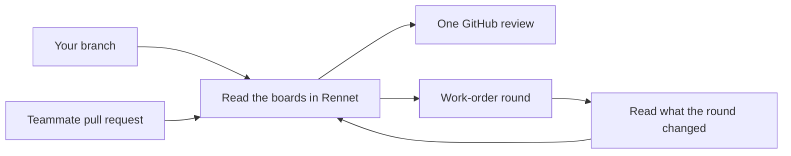

Rennet drafts a local branch or a GitHub pull request into boards you can read,
then turns what you raise into a review, a work order, or a pull request. Start
with the tour, then follow the guide for the change in front of you.

## Start here

- [Getting started](./guides/getting-started.md) walks the whole loop: add a project, read the boards, stage asks, take an exit.
- [The onboarding tour](./guides/onboarding-tour.md) explains the first-run coach marks: contextual, one at a time, skippable, and replayable from Help.
- [Connect to GitHub](./guides/github-auth.md) signs Rennet into GitHub for pull request reviews.
- [Review a GitHub pull request](./guides/reviewing-a-github-pr.md) covers a teammate's pull request and the review you post on it.
- [The Context Map](./guides/context-map.md) shows the project context available to reviews.
- [Remote access](./guides/remote-access.md) connects another device to a Rennet daemon.

## Understand the product

- [Product and vision](./concepts/product-and-vision.md) explains what Rennet is for.
- [Common questions](./concepts/common-questions.md) covers models, credentials, data, and GitHub.

A teammate's pull request becomes one GitHub review, posted under your name. On
your own branch the same asks become a work order: a coding agent runs the
round, you read its report and the regenerated boards, and when nothing is left
to ask, Rennet pushes the branch and opens the pull request.
