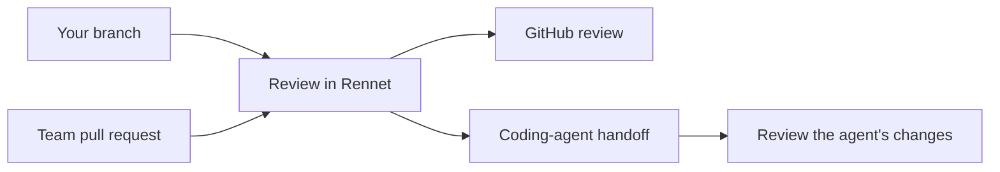

Rennet turns a local change or GitHub pull request into an ordered review. Start
with the short tour, then follow the guide for the change in front of you.

## Start here

- [Getting started](./guides/getting-started.md) covers the main review loop.
- [Review a GitHub pull request](./guides/reviewing-a-github-pr.md) covers the team review path.
- [The Context Map](./guides/context-map.md) shows the project context available to reviews.
- [Remote access](./guides/remote-access.md) connects another device to a Rennet daemon.

## Understand the product

- [Product and vision](./concepts/product-and-vision.md) explains what Rennet is for.
- [Common questions](./concepts/common-questions.md) covers models, credentials, data, and GitHub.

A team pull request can become one GitHub review. On your own branch, you can
send requested changes to a coding agent, inspect its work, then push the branch
and open a pull request.
