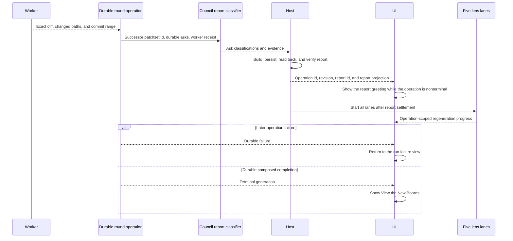

# C9 — Rounds experience: dispatch → live run → the round report as greeting → the ledger → post-round delta marks (#489)

## Why

INVENTORY §7 carries ~40 `[ws:C9]` claims — the review's **iteration** loop (R34, #458). A reviewer stages asks on a board, dispatches a **work-order round**, watches a worker apply the asks live in a detached worktree, and is greeted on return by a **round report** built from the exact worker receipt while the five lens drafters regenerate the boards beneath it. That report is separate from the deterministic successor account and Delta machinery. When the new generation composes, one control transitions to it; delta marks say what moved. Every completed round stays reachable through a ledger beside the Map·Diff pill. C9 is the surface that turns C5's board reading and C8's own-branch hand-off into a loop the reviewer drives to convergence.

The spike animated the whole loop with **simulated `setTimeout` timelines** (§13): `run-view.tsx` counts a fake clock to 10 100ms and fires `onReady`; `round-report.tsx` runs a scripted regeneration to 8 300ms. Both are rewrites, not ports — real progress rides `onProgress` folded through `useCommandStream` into a read, exactly as C1 built the data seam. The named anti-pattern is autopsy **S9**: the spike's `app/s/[slug]/run/page.tsx` navigates from an effect and needs an `alreadyRanAtMount` ref to stop its own `router.replace` racing a `router.push` — a race its own comment admits. C9's run route models the round as a **state machine** and navigates from its transitions, never from an effect that reads the state the navigation mutates. That is the spine of this change.

The report is not a bespoke component. INVENTORY §7.1 makes it a **first-class board** that reuses C5's element registry: a `LensBoard`-shaped board whose elements are `round_outcome` items (status · ask · note · code_ref) under a prose greeting. C5 already excludes `round_outcome` from the lens-board registry and annotates it "→ C9's round report (reuses this registry)". So the report renders through the same `Element`/`Section` machinery with the registry **widened** to carry `round_outcome` — one renderer, one totality proof, not a second rendering path.

## What Changes

- **A rounds data seam** (`rounds/rounds-data.ts`), mirroring C5's `BoardSource` context exactly: a `RoundState` discriminated union (the run machine), `useRoundState(slug)`, `useRoundRecords(slug)` (the ledger's completed `RoundRecord`s), and `useReportBoard(id)`. The default context is **honest-absent** (no round, no records); fixtures live behind the import fence (`test/fixtures/rounds/`) for tests and dev; the seam bodies become `useCommand`/`useCommandStream` over B9's real rounds runtime in one gated cluster. The `run` store slice (`store/run.ts` — `roundProgress`/`greetingArmed`/`laneStatus`/`resetRun`, already landed by C1) is **reused**, not rebuilt.
- **The round-report board** — reuse and **widen** C5's element registry with a `round_outcome` renderer (`board/kinds/round-outcome.tsx`) plus a report registry that carries it; the greeting is the board's prose. A report board with an unrendered kind is a **compile error** (the C5 `assertNever` totality, extended).
- **The run route** (`rounds/run-route.tsx`) — replaces the `Interim` placeholder now mounted at `ROUTES.sessionRun` in `routes/app.tsx`. Live takeover driven by folded `onProgress` (never `setTimeout`), modeled as a state machine, deep-linkable **cold**: mounting reads current round state and reattaches its subscription with **no dispatch on mount** (dispatch is the explicit Dispatch act only), so a cold mid-round deep-link never double-dispatches.
- **Dispatch wiring** — close C8's deliberately-disabled `onDispatch` seam (`rounds-lanes.tsx: disabled={!gathering || !onDispatch}`): thread `onDispatch` from the workspace → `HandoffView` → `RoundsLanes` through the seam's `dispatch()` + navigate to `/s/:slug/run`.
- **The round report as greeting + progressive reveal** — after the host verifies the persisted report read-back, the report board fills the surface while regeneration is still nonterminal. A required report failure returns to the run failure view before lens fan-out; it cannot masquerade as long-running report drafting. A cold board-route reload reconstructs a successful handoff from durable state rather than an in-memory arm. A later failure returns to the run failure view. **View the New Boards** appears only at terminal composition, derived from state and never a disabled button waiting to enable.
- **The rounds ledger** (`?view=rounds`) — the `rounds` branch in `ReviewWorkspace`, its pill present **exactly when** the session has ≥1 completed round (absent-not-disabled). One row per round; the selected report renders beneath (the same report registry); each round's frozen generation is reachable via C5's generation switcher and its diff via the diff surface.
- **Post-round delta marks** (R58) — on landing at generation N+1, section `delta` badges (`new`/`reworked`; carried = absent) surface what moved and decay on view, **reusing** C5's `board/viewed-delta.ts`, not a new mechanism.

## Out of scope

The round engine (B8/B9/B11) — the worker, the report classification seat, the append-then-freeze generation minting. The exits lanes themselves (C8). C9 introduced **no protocol change**: `RoundRecord`, the `round_outcome` element, and `SectionDelta` already existed in `packages/protocol`. The later durable-runtime binding added operation-scoped report and lens events; that is a runtime follow-up, not a retroactive C9 ownership claim.

## Reconciliations (part of the spec)

1. **B9's rounds runtime does not exist yet.** No `createRoundsRuntime` / rounds command is registered in `core`/`adapters`/`server`, and none is wired into `create-server`. So every live-round affordance is **B9-gated through the C5-style seam** — honest-absent by default, fixtures behind the fence for tests, a **one-file swap** to `useCommand`/`useCommandStream` when B9 lands (mirroring C5's `board-data.ts` cluster-8 gate). This is NOT a stub with fake success: the shipped app with no live source supplied shows no dispatchable round and an absent ledger, the truth.
2. **The `run` store slice is already landed** (C1, `store/run.ts`) with the exact fields the loop needs (`roundProgress`, `greetingArmed`, `laneStatus`, `resetRun`) and derived selectors (`selectRoundRunning`, `selectRunningLaneCount`). C9 reuses it; it invents no new run state.
3. **The report reuses C5's registry.** `round_outcome` sits in C5's `BOARD_EXCLUDED_KINDS` explicitly annotated as C9's report board; the report widens the registry to render it rather than modelling a parallel board type. The board-data boundary already rejects a lens board carrying `round_outcome` as `invalid` (excluded-kind) — that stays; the widening is report-surface-only.
4. **The run route currently mounts an `Interim` placeholder** at `ROUTES.sessionRun` in `routes/app.tsx`; C9 replaces that one `<Route>` body. The router topology (persistent layout outside the outlet, seam-swap slug resolution) is C1's and is mirrored, not re-litigated.
5. **Delta-mark decay reuses `board/viewed-delta.ts`** (C5). The "viewed set that decays the mark is UI-only" is already a landed concern; C9's job is the post-round *arrival* behaviour and the badge render, reconciled with what C5's `section.tsx` already draws — reuse over reinvention.

## Impact

- **New:** `packages/app-ui/src/rounds/` (run route, report greeting, ledger, rounds-data seam, barrel); `packages/app-ui/src/board/kinds/round-outcome.tsx` + the report registry; `packages/app-ui/src/test/fixtures/rounds/`.
- **Touched:** `routes/app.tsx` (replace the `sessionRun` `Interim`); `app/review-workspace-route.tsx` (the `rounds` view branch + thread `onDispatch`); `handoff/rounds-lanes.tsx` consumers (the seam-backed `onDispatch`, no change to the lane itself). `app-ui/src/index.ts` re-exports the rounds barrel.
- **Docs:** `docs/developing/concepts/handoff-and-exits.md` (the rounds loop end to end), plus the INVENTORY §7-named pages (SCENARIOS / CONTEXT) as the surface lands.
- **No new package; no protocol change.** The licenses/architecture gates pass over an unchanged dependency set.

## Review findings — post-review amendments (PR #536)

Dual review (opus APPROVE / Codex BLOCK) raised 6 findings; the orchestrator upheld all 6 under Rule Zero (none is a gate/ceremony/capability-removal). These are logic/honesty fixes on C09-owned machinery that is B11-gated at runtime (`ABSENT_ROUNDS_SOURCE`), fixed now because C09 owns it.

- **F1 (High) — the report owns the reveal.** `review-workspace-route.tsx` first branched on `greetingArmed && inReportPhase && report.status === "valid"`; a missing/invalid report fell through to `LensBoardView` at the composed generation, exposing the new boards WITHOUT the "View the New Boards" act and swallowing the report failure. The original fix branched on `greetingArmed && inReportPhase` and rendered honest `missing`/`invalid` states (`ReportUnavailable`). The durable-runtime binding goes further: a nonterminal report phase shows the verified report projection even after a cold reload, regardless of the ephemeral arm; completed greetings still require the arm, so reload does not resurrect a consumed greeting. A later durable failure returns to the run failure surface. The successor boards stay hidden until the terminal Reveal act. Honest-failure surface, not a gate.
- **F2 (High) — the Round-diff link stops silently resolving to "latest".** The ledger's Round-diff link navigated to a bare `?view=diff`; `DiffViewContainer` reads only `review.activePatchsetId`, so selecting Round 1 after Round 2 showed the LATEST patchset, not Round 1's immutable diff (packet §7). The link now carries the round's generation identity (`?round=<generation>`, wired through `SessionQuery`), and `DiffViewContainer` renders an HONEST round-diff-pending state for a round request. B9/B4 gap parked: resolving a generation to its frozen patchset needs a per-round patchset the projection does not carry (`Review` has only `activePatchsetId` + current `patchsets`, no generation/commit-range key). C09 wires the URL identity now; the immutable-diff resolution lands when B9 adds `RoundRecord.patchsetId` or a generation-to-patchset projection. The link no longer lies.
- **F4 (Medium) — report validation now holds the runtime domain.** `resolveReportBoard` checked only `LensBoardSchema`. It did not verify the resolved board's `boardId` against the requested id (a cross-wired board rendered AS the selected report), nor reject a `review_comment` element — a schema-valid `HostKind` outside `ReportKind` that parses `valid` then THROWS in `ReportElement` (`assertExcludedKind`). `resolveReportBoard(raw, expectedId)` now takes the expected id (from `useReportBoard`), rejects an id mismatch, and rejects any board carrying `review_comment` (the sole kind outside the report domain — `BOARD_EXCLUDED_KINDS` minus `round_outcome`). Both resolve `invalid` DATA; the compile-time `@ts-expect-error` totality control for `ReportKind` is untouched — this is the runtime boundary it cannot cover. Controls: wrong-id board, referenced-`review_comment`.
- **F5 (Medium) — regeneration lanes render every status honestly.** The greeting's `RegenerationProgress` collapsed every status except `running` to a green check + "done", so a `queued` or `failed` drafter read as a settled success. It now renders through the SAME `StatusIcon` the run route uses (exported and shared) with an exhaustive `RowStatus` label — queued reads "queued", failed reads "failed" (danger-tinted). DOM cases for queued and failed. UI honesty — a feature.
- **F3 (High) — the generation-switcher fixture is now producer-shaped; frozen-gen reachability parked as a B9 gap.** The fixture set `boardGeneration: "gen1"`, `mintedPatchsetGeneration: "gen2"` — two different ids. The real producer (`server/src/runtime/rounds.ts:319`) sets BOTH to the newly minted generation for a landed round (a round reports against the generation its own worker minted), so production-shaped data always dedups to ONE generation; the earlier fixture's two-id shape made the ledger's `[frozen, minted]` pair look like a reachable history it can never be. **Verdict: genuine B9 schema gap.** The frozen PREDECESSOR the switcher would drill back to is never persisted onto `RoundRecord` — the runtime freezes it as `RoundOutcome.frozenPrevious` but drops it from the record. Fix: (a) `completedRoundRecord` is now producer-shaped (`boardGeneration === mintedPatchsetGeneration === "gen2"`); (b) the ledger opens the round's single generation and the switcher stays hidden; (c) the two tests that asserted a drillable `gen1` frozen tab now assert the honest single-generation reality. **Parked cross-workstream follow-up:** frozen-generation reachability returns when B9 adds a `RoundRecord` predecessor field (e.g. `previousGeneration`) so the ledger has an earlier id to hand the switcher.
- **F6 (Low) — the delta test proves classification, not just presence.** `post-round-delta.dom.test.tsx` asserted two dots on arrival that decay on view — but stayed green if `new`↔`reworked` were swapped. It now pins each section's `delta` by id: "Still Open" (`g2-open`) is `reworked`, "Beyond the Asks" (`g2-beyond`) is `new`, and the carried-forward frozen section (`g2-gen1`) has neither a `data-delta` attribute nor a dot.

### Follow-ups parked for other workstreams (from these findings)

- **B9 — `RoundRecord` predecessor field.** Add a persisted frozen-predecessor generation id to `RoundRecord` (the runtime already computes it as `RoundOutcome.frozenPrevious`). Unblocks the rounds ledger's generation switcher (F3).
- **B9/B4 — per-round patchset resolution.** A `RoundRecord.patchsetId` (or a generation→patchset projection carried on the `Review`) so the ledger's Round-diff link resolves a past round's IMMUTABLE diff instead of the honest "not wired yet" state (F2).
