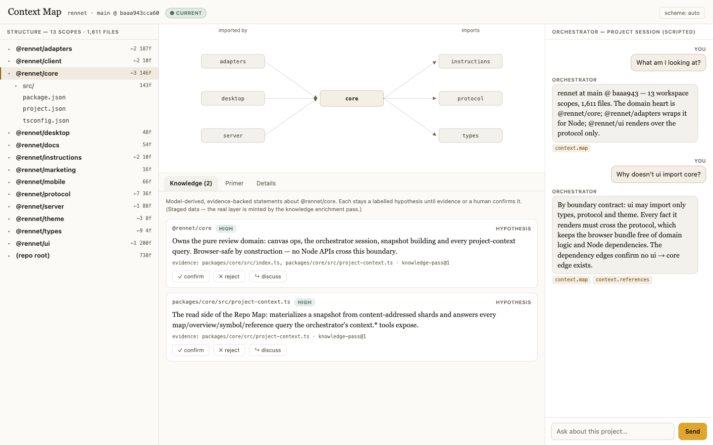
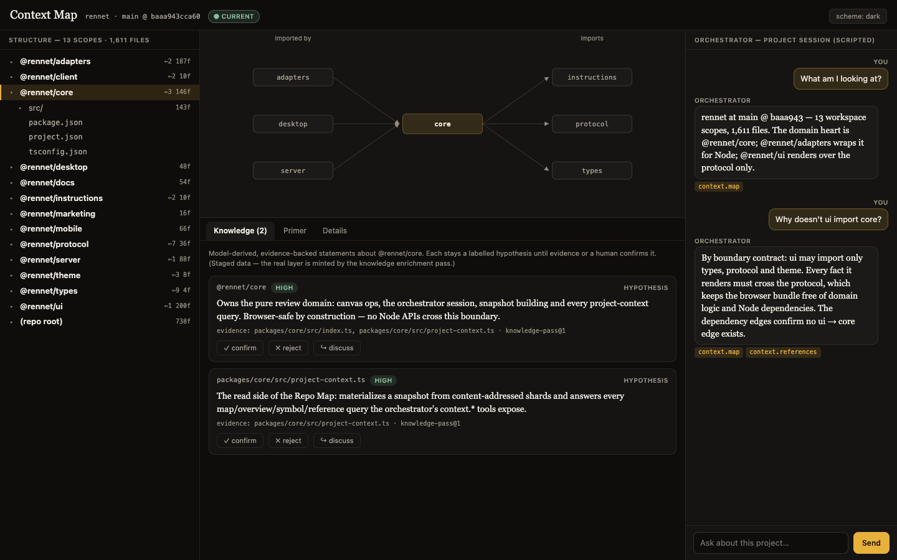

# Context Map view — spike

A throwaway Vite prototype of the proposed **Context Map** surface: explore, understand
and refine a project's Repo Map, side by side with a project-scoped orchestrator
conversation.




## Run

```sh
npm install
npm run dev     # http://localhost:5210
```

## What's real, what's staged

- **Real**: the structure data (`rennet-map.json`) is Rennet's own Repo Map of this
  repository — files, scopes, dependency edges, entry points, tests, conventions, and
  per-file declared symbols. Regenerate it with the real generator:
  `rennet map <repo> --json spikes/context-map-view/rennet-map.json`
  (the CLI bundle lives at `packages/server/dist/rennet.cjs`). The palette is the real
  shared `packages/theme/src/palette.css` (imported, not copied).
- **Staged**: the knowledge-layer claims are handcrafted (the real ones come from the
  model-backed enrichment pass and cost tokens), the primer pane is a mocked rendering
  of the primer's six sections, and the conversation is scripted — the production view
  speaks to a project-scoped orchestrator session over the `context.*` tools.

## What the spike is for

Judging the layout and the explore → refine loop: roll-up tree as the spine, a
neighborhood graph for the selected node (never a whole-repo hairball), knowledge
claims with confirm / reject / discuss, and the chat rail driving refinement.
